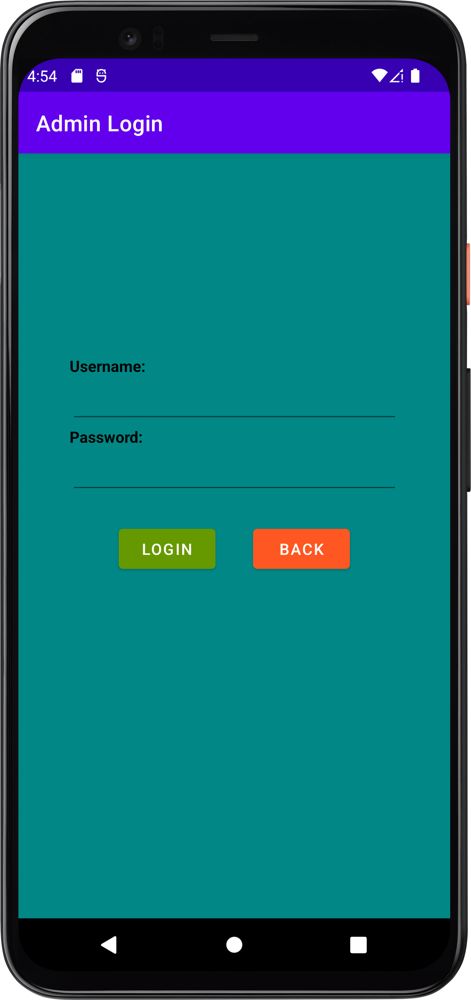

# Floor Manager App

## Table of Content

- [Description](#description)
- [Features](#features)
- [How To Use](#how-to-use)

## Description

- An Android app that let employee manage their inventory and customer search for company's product

## Features

- Firebase
    - Product's informations are stored on real time database of Firebase (Java)

## How To Use

1. Download the FloorManagerApp.apk file
2. Install the app on an Android phone or emulator

### Home page

### Search Product(s)

1. Press  to go to the searching page

2. Choose the store, category, and type that you are looking for

    

3. Press  to see the result

    

### Add New Product(s)

1. Press  to go to the admin login page

    

2. Enter the admin username and password. The username is "admin" and the password is "1234".

3. Press  to go to the admin page

    

4. Press  to go to the add product page

    

5. Enter all the information properly

6. Press  to save the new product

### Edit Product(s)

1. Go to the admin page following the instructions above

2. Press  to go to the searching page

    

3. Choose the correct store, category, and enter the product's name (case sensitive)

4. Press  to see the result

    

5. Change the information that you need to change and press  to save those change(s)

### Delete Product(s)

1. Go to the admin page following the instructions above

2. Search for a specific product following the instructions above

3. Press  to remove the product from inventory